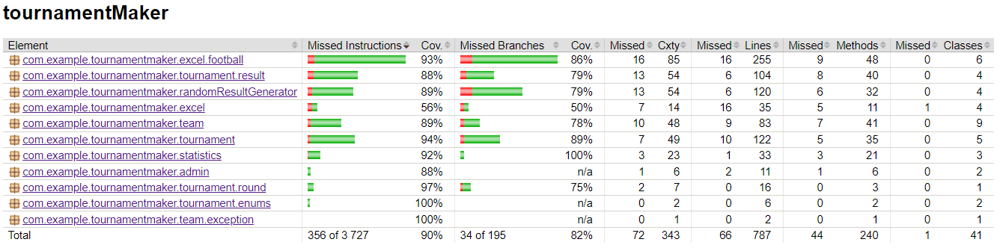

# TOURNAMENT MAKER
## Short project description

The project is a web application serving as an excellent tool for managing sports tournaments. It has been constructed to handle both cup and league tournaments, providing versatile functionality for organizers.

Its key feature is the ability to generate the current tournament status in an Excel file. This detailed report not only includes the current match results but also team and player statistics. Users can easily track achievements such as the number of goals scored or the ranking of top scorers in a given tournament."

## Used technologies
* Java 17
* Spring Boot 3.0.6
* JSON WEB Token 0.11.5
* PostgreSQL
* H2 Database
* JUnit 5.0.0
* Apache POI 5.2.3
* Maven 4.0.0
* JaCoCo 0.8.10


Project is tested using JUnit 5 + Mockito. Test coverage analysis is performed using JaCoCo.

**The test coverage is 86%**



## Requirements to launch application
* JDK 17
* Maven 4

### Cloning repository
https://github.com/kamilnapiontek/tournamentMaker <br>
```bash
cd tournamentMaker
mvn clean install
mvn spring-boot:run
```

## Description of HTTP requests
### 1. Obtaining a token
**Path**<br/>
<span style="color:green">*/api/v1/auth/authenticate*</span>

**Method**<br/>
POST

**HTTP headers**<br/>
*Content-Type: application/json*

**Body**
``` json
{
    "email":"admin@wp.pl",
    "password":"admin"
}
```

**Answer**
<span style="color:green">HTTP 200 OK**</span>
``` json
{
   "access_token": *<accessToken>*,
    "refresh_token": *<refreshToken>* 
}
```

**or**
<span style="color:red">HTTP 403 Forbidden**</span>
</br></br></br>

### 2. Creating tournament
**Path**<br/>
<span style="color:green">*/api/tournament/create*</span>

**Method**<br/>
POST

**HTTP headers**<br/>
*Content-Type: application/json* <br> 
*Authorization: <access_token>*

**Body**
``` json
{
    "name":"Tournament",
    "sport":"FOOTBALL",
    "tournamentType":"CUP"
}
```

**Answer**
<span style="color:green">HTTP 200 OK**</span>
**or**
<span style="color:red">HTTP 403 Forbidden**</span>

### 3. Create football teams with players, or you can create empty team <br> and fill it by players manually using endpoints below (4,5)
**Path**<br/>
<span style="color:green">*/api/team/createFootballTeamsWithPlayers*</span>

**Method**<br/>
POST

**HTTP headers**<br/>
*Content-Type: application/json*

**Body**
``` json
{
    {
  "tournamentName": "Tournament",
  "teams": [
    {
  "teamName": "FC Barcelona",
  "players": [
    {
      "firstName": "Lionel",
      "lastName": "Messi",
      "jerseyNumber": 10,
      "footballPosition": "FORWARD"
    },
    {
      "firstName": "Andrés",
      "lastName": "Iniesta",
      "jerseyNumber": 8,
      "footballPosition": "MIDFIELDER"
    },
    {
      "firstName": "Xavi",
      "lastName": "Hernandez",
      "jerseyNumber": 6,
      "footballPosition": "MIDFIELDER"
    },
    {
      "firstName": "Ronaldinho",
      "lastName": "Gaúcho",
      "jerseyNumber": 21,
      "footballPosition": "FORWARD"
    },
    {
      "firstName": "Carles",
      "lastName": "Puyol",
      "jerseyNumber": 5,
      "footballPosition": "DEFENDER"
    },
    {
      "firstName": "Gerard",
      "lastName": "Piqué",
      "jerseyNumber": 3,
      "footballPosition": "DEFENDER"
    },
    {
      "firstName": "Dani",
      "lastName": "Alves",
      "jerseyNumber": 2,
      "footballPosition": "DEFENDER"
    },
    {
      "firstName": "Victor",
      "lastName": "Valdes",
      "jerseyNumber": 1,
      "footballPosition": "GOALKEEPER"
    },
    {
      "firstName": "Johan",
      "lastName": "Cruyff",
      "jerseyNumber": 14,
      "footballPosition": "FORWARD"
    },
    {
      "firstName": "Rivaldo",
      "lastName": "Vitor Borba Ferreira",
      "jerseyNumber": 11,
      "footballPosition": "FORWARD"
    },
    {
      "firstName": "Jordi",
      "lastName": "Alba",
      "jerseyNumber": 18,
      "footballPosition": "DEFENDER"
    }
  ]
},
   {
  "teamName": "Real Madrid",
  "players": [
    {
      "firstName": "Cristiano",
      "lastName": "Ronaldo",
      "jerseyNumber": 7,
      "footballPosition": "FORWARD"
    },
    {
      "firstName": "Luka",
      "lastName": "Modric",
      "jerseyNumber": 10,
      "footballPosition": "MIDFIELDER"
    },
    {
      "firstName": "Sergio",
      "lastName": "Ramos",
      "jerseyNumber": 4,
      "footballPosition": "DEFENDER"
    },
    {
      "firstName": "Karim",
      "lastName": "Benzema",
      "jerseyNumber": 9,
      "footballPosition": "FORWARD"
    },
    {
      "firstName": "Toni",
      "lastName": "Kroos",
      "jerseyNumber": 8,
      "footballPosition": "MIDFIELDER"
    },
    {
      "firstName": "Marcelo",
      "lastName": "Vieira",
      "jerseyNumber": 12,
      "footballPosition": "DEFENDER"
    },
    {
      "firstName": "Gareth",
      "lastName": "Bale",
      "jerseyNumber": 11,
      "footballPosition": "FORWARD"
    },
    {
      "firstName": "Raphaël",
      "lastName": "Varane",
      "jerseyNumber": 5,
      "footballPosition": "DEFENDER"
    },
    {
      "firstName": "Thibaut",
      "lastName": "Courtois",
      "jerseyNumber": 1,
      "footballPosition": "GOALKEEPER"
    },
    {
      "firstName": "Ferland",
      "lastName": "Mendy",
      "jerseyNumber": 23,
      "footballPosition": "DEFENDER"
    },
    {
      "firstName": "Casemiro",
      "lastName": "Ferreira",
      "jerseyNumber": 14,
      "footballPosition": "MIDFIELDER"
    }
  ]
}, {
  "teamName": "Manchester United",
  "players": [
    {
      "firstName": "Wayne",
      "lastName": "Rooney",
      "jerseyNumber": 10,
      "footballPosition": "FORWARD"
    },
    {
      "firstName": "Bruno",
      "lastName": "Fernandes",
      "jerseyNumber": 18,
      "footballPosition": "MIDFIELDER"
    },
    {
      "firstName": "Harry",
      "lastName": "Maguire",
      "jerseyNumber": 5,
      "footballPosition": "DEFENDER"
    },
    {
      "firstName": "Marcus",
      "lastName": "Rashford",
      "jerseyNumber": 17,
      "footballPosition": "FORWARD"
    },
    {
      "firstName": "Paul",
      "lastName": "Pogba",
      "jerseyNumber": 6,
      "footballPosition": "MIDFIELDER"
    },
    {
      "firstName": "Luke",
      "lastName": "Shaw",
      "jerseyNumber": 23,
      "footballPosition": "DEFENDER"
    },
    {
      "firstName": "Edinson",
      "lastName": "Cavani",
      "jerseyNumber": 21,
      "footballPosition": "FORWARD"
    },
    {
      "firstName": "Victor",
      "lastName": "Lindelöf",
      "jerseyNumber": 2,
      "footballPosition": "DEFENDER"
    },
    {
      "firstName": "David",
      "lastName": "De Gea",
      "jerseyNumber": 1,
      "footballPosition": "GOALKEEPER"
    },
    {
      "firstName": "Aaron",
      "lastName": "Wan-Bissaka",
      "jerseyNumber": 29,
      "footballPosition": "DEFENDER"
    },
    {
      "firstName": "Scott",
      "lastName": "McTominay",
      "jerseyNumber": 39,
      "footballPosition": "MIDFIELDER"
    }
  ]
}, {
  "teamName": "Arsenal",
  "players": [
    {
      "firstName": "Pierre-Emerick",
      "lastName": "Aubameyang",
      "jerseyNumber": 14,
      "footballPosition": "FORWARD"
    },
    {
      "firstName": "Bukayo",
      "lastName": "Saka",
      "jerseyNumber": 7,
      "footballPosition": "MIDFIELDER"
    },
    {
      "firstName": "Gabriel",
      "lastName": "Magalhães",
      "jerseyNumber": 6,
      "footballPosition": "DEFENDER"
    },
    {
      "firstName": "Emile",
      "lastName": "Smith Rowe",
      "jerseyNumber": 10,
      "footballPosition": "MIDFIELDER"
    },
    {
      "firstName": "Thomas",
      "lastName": "Partey",
      "jerseyNumber": 18,
      "footballPosition": "MIDFIELDER"
    },
    {
      "firstName": "Kieran",
      "lastName": "Tierney",
      "jerseyNumber": 3,
      "footballPosition": "DEFENDER"
    },
    {
      "firstName": "Bernd",
      "lastName": "Leno",
      "jerseyNumber": 1,
      "footballPosition": "GOALKEEPER"
    },
    {
      "firstName": "Alexandre",
      "lastName": "Lacazette",
      "jerseyNumber": 9,
      "footballPosition": "FORWARD"
    },
    {
      "firstName": "Rob",
      "lastName": "Holding",
      "jerseyNumber": 16,
      "footballPosition": "DEFENDER"
    },
    {
      "firstName": "Héctor",
      "lastName": "Bellerín",
      "jerseyNumber": 2,
      "footballPosition": "DEFENDER"
    },
    {
      "firstName": "Granit",
      "lastName": "Xhaka",
      "jerseyNumber": 34,
      "footballPosition": "MIDFIELDER"
    }
  ]
}, {
  "teamName": "AC Milan",
  "players": [
    {
      "firstName": "Zlatan",
      "lastName": "Ibrahimović",
      "jerseyNumber": 11,
      "footballPosition": "FORWARD"
    },
    {
      "firstName": "Franck",
      "lastName": "Kessié",
      "jerseyNumber": 79,
      "footballPosition": "MIDFIELDER"
    },
    {
      "firstName": "Alessio",
      "lastName": "Romagnoli",
      "jerseyNumber": 13,
      "footballPosition": "DEFENDER"
    },
    {
      "firstName": "Rafael",
      "lastName": "Leão",
      "jerseyNumber": 17,
      "footballPosition": "FORWARD"
    },
    {
      "firstName": "Ismaël",
      "lastName": "Bennacer",
      "jerseyNumber": 4,
      "footballPosition": "MIDFIELDER"
    },
    {
      "firstName": "Theo",
      "lastName": "Hernández",
      "jerseyNumber": 19,
      "footballPosition": "DEFENDER"
    },
    {
      "firstName": "Mike",
      "lastName": "Maignan",
      "jerseyNumber": 16,
      "footballPosition": "GOALKEEPER"
    },
    {
      "firstName": "Ante",
      "lastName": "Rebić",
      "jerseyNumber": 18,
      "footballPosition": "FORWARD"
    },
    {
      "firstName": "Fikayo",
      "lastName": "Tomori",
      "jerseyNumber": 23,
      "footballPosition": "DEFENDER"
    },
    {
      "firstName": "Davide",
      "lastName": "Calabria",
      "jerseyNumber": 2,
      "footballPosition": "DEFENDER"
    },
    {
      "firstName": "Sandro",
      "lastName": "Tonali",
      "jerseyNumber": 8,
      "footballPosition": "MIDFIELDER"
    }
  ]
}, {
  "teamName": "Bayern Munich",
  "players": [
    {
      "firstName": "Robert",
      "lastName": "Lewandowski",
      "jerseyNumber": 9,
      "footballPosition": "FORWARD"
    },
    {
      "firstName": "Thomas",
      "lastName": "Müller",
      "jerseyNumber": 25,
      "footballPosition": "FORWARD"
    },
    {
      "firstName": "David",
      "lastName": "Alaba",
      "jerseyNumber": 27,
      "footballPosition": "DEFENDER"
    },
    {
      "firstName": "Manuel",
      "lastName": "Neuer",
      "jerseyNumber": 1,
      "footballPosition": "GOALKEEPER"
    },
    {
      "firstName": "Leon",
      "lastName": "Goretzka",
      "jerseyNumber": 18,
      "footballPosition": "MIDFIELDER"
    },
    {
      "firstName": "Joshua",
      "lastName": "Kimmich",
      "jerseyNumber": 6,
      "footballPosition": "MIDFIELDER"
    },
    {
      "firstName": "Kingsley",
      "lastName": "Coman",
      "jerseyNumber": 29,
      "footballPosition": "FORWARD"
    },
    {
      "firstName": "Niklas",
      "lastName": "Süle",
      "jerseyNumber": 4,
      "footballPosition": "DEFENDER"
    },
    {
      "firstName": "Leroy",
      "lastName": "Sané",
      "jerseyNumber": 10,
      "footballPosition": "FORWARD"
    },
    {
      "firstName": "Lucas",
      "lastName": "Hernández",
      "jerseyNumber": 21,
      "footballPosition": "DEFENDER"
    },
    {
      "firstName": "Serge",
      "lastName": "Gnabry",
      "jerseyNumber": 7,
      "footballPosition": "FORWARD"
    }
  ]
}, {
  "teamName": "Ajax Amsterdam",
  "players": [
    {
      "firstName": "Dusan",
      "lastName": "Tadic",
      "jerseyNumber": 10,
      "footballPosition": "FORWARD"
    },
    {
      "firstName": "David",
      "lastName": "Neres",
      "jerseyNumber": 7,
      "footballPosition": "FORWARD"
    },
    {
      "firstName": "Nicolás",
      "lastName": "Tagliafico",
      "jerseyNumber": 31,
      "footballPosition": "DEFENDER"
    },
    {
      "firstName": "André",
      "lastName": "Onana",
      "jerseyNumber": 24,
      "footballPosition": "GOALKEEPER"
    },
    {
      "firstName": "Ryan",
      "lastName": "Gravenberch",
      "jerseyNumber": 29,
      "footballPosition": "MIDFIELDER"
    },
    {
      "firstName": "Daley",
      "lastName": "Blind",
      "jerseyNumber": 17,
      "footballPosition": "DEFENDER"
    },
    {
      "firstName": "Antony",
      "lastName": "Matheus dos Santos",
      "jerseyNumber": 39,
      "footballPosition": "FORWARD"
    },
    {
      "firstName": "Jurriën",
      "lastName": "Timber",
      "jerseyNumber": 21,
      "footballPosition": "DEFENDER"
    },
    {
      "firstName": "Maarten",
      "lastName": "Stekelenburg",
      "jerseyNumber": 1,
      "footballPosition": "GOALKEEPER"
    },
    {
      "firstName": "Devyne",
      "lastName": "Rensch",
      "jerseyNumber": 2,
      "footballPosition": "DEFENDER"
    },
    {
      "firstName": "Mohammed",
      "lastName": "Kudus",
      "jerseyNumber": 20,
      "footballPosition": "MIDFIELDER"
    }
  ]
}]}}
```

**Answer**
<span style="color:green">HTTP 200 OK**</span>
**or**
<span style="color:red">HTTP 403 Forbidden**</span>

### 4. Creating team (you can use 3 endpoint to create team with players)
**Path**<br/>
<span style="color:green">*/api/team/create*</span>

**Method**<br/>
POST

**HTTP headers**<br/>
*Content-Type: application/json*

**Body**
``` json
{
    "tournamentName" : "Tournament",
    "teamName" : "Team name"
}
```

**Answer**
<span style="color:green">HTTP 200 OK**</span>
**or**
<span style="color:red">HTTP 403 Forbidden**</span>

### 5. Create player and add to team (you can use 3 endpoint to create team with players)
**Path**<br/>
<span style="color:green">*/api/team/create-player-add-to-team*</span>

**Method**<br/>
POST

**HTTP headers**<br/>
*Content-Type: application/json*

**Body**
``` json
{
    "tournamentName" : "Tournament",
    "firstName" : "First Name",
    "lastName" : "Last name",
    "jerseyNumber" : 1,
    "footballPosition" : "GOALKEEPER"
}
```

**Answer**
<span style="color:green">HTTP 200 OK**</span>
**or**
<span style="color:red">HTTP 403 Forbidden**</span>

### 6. Create schedule
OPSIAĆ TO LEPIEJ
**Path**<br/>
<span style="color:green">*/api/tournament/createSchedule*</span>

**Method**<br/>
POST

**HTTP headers**<br/>
*Content-Type: application/json*

**Body**
``` json
{
    "tournamentName":"Tournament"
}
```

**Answer**
<span style="color:green">HTTP 200 OK**</span>
**or**
<span style="color:red">HTTP 403 Forbidden**</span>

### 7. Generate random results with statistics for tournament
If you don't want to fill tournament data manually, then you can generate random results

**Path**<br/>
<span style="color:green">*/api/randomGenerator*</span>

**Method**<br/>
POST

**HTTP headers**<br/>
*Content-Type: application/json*

**Body**
``` json
{
    "tournamentName" : "Tournament",
    "roundsToDraw" : "1-3"
}
```

**Answer**
<span style="color:green">HTTP 200 OK**</span>
**or**
<span style="color:red">HTTP 403 Forbidden**</span>

### 8. Generate the current tournament status with statistics in excel file
**Path**<br/>
<span style="color:green">*/api/exel*</span>

**Method**<br/>
POST

**HTTP headers**<br/>
*Content-Type: application/json*

**Body**
``` json
{
    "tournamentName" : "Tournament"
}
```

**Answer**
<span style="color:green">HTTP 200 OK**</span>
**or**
<span style="color:red">HTTP 403 Forbidden**</span>

This endpoint generates excel file in: 

*src/main/resources/tournamentMaker.xlsx*


## Project structure

source code -> src/main/java

application resources -> src/main/resources

